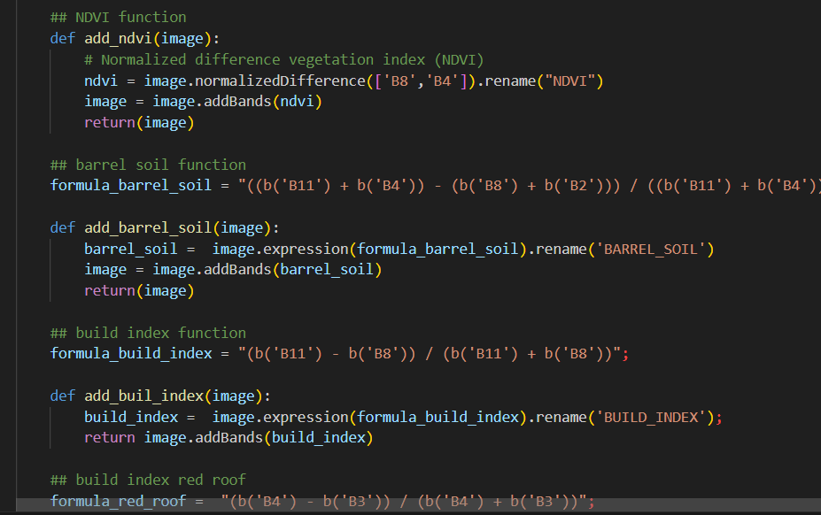
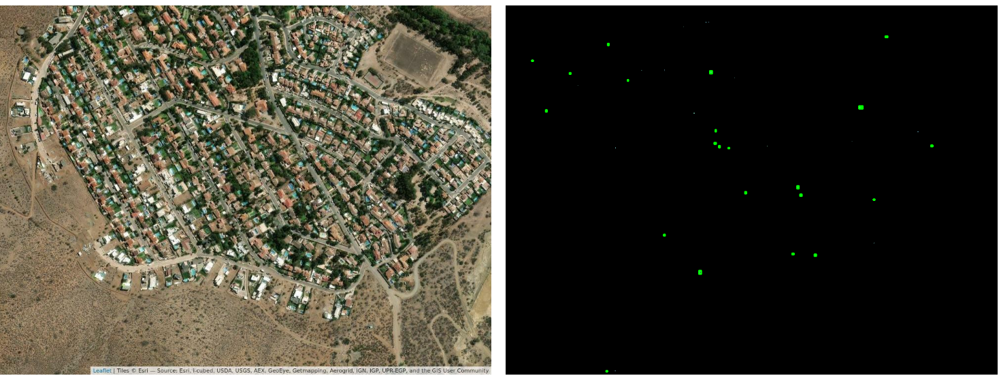

class: center, middle

.linea-superior[]
.linea-inferior[]


## Estratificación socioeconómica del marco muestral de viviendas a través del uso de imágenes satelitales

### Experiencia durante el programa de aceleración de ciencia de datos 

#### Abril 2024


```{r setup, include=FALSE}
options(htmltools.dir.version = TRUE)
knitr::opts_chunk$set(message = FALSE, echo = FALSE) 
```

```{r xaringan-themer, include=FALSE, warning=FALSE}
library(xaringanthemer)
xaringanExtra::use_panelset()
xaringanExtra::use_clipboard()
library( ggpmisc)
library(tidyverse)
```

---

background-image: url("imagenes/fondo2.PNG")
background-size: contain;
background-position: 100% 0%

# El plan

## 20 minutos de presentación

## 20 minutos de trabajo en grupos 

## 20 minutos para compartir ideas
 

---

background-image: url("imagenes/fondo2.PNG")
background-size: contain;
background-position: 100% 0%

# Objetivo inicial

Estratificar algunas porciones del marco muestral de viviendas en la región metropolitana, identificando UPM estratos alto, medio y bajo, por medio de imágenes satelitales y visión computacional

--

.center[

]


---

background-image: url("imagenes/fondo2.PNG")
background-size: contain;
background-position: 100% 0%

# Objetivo alcanzable en el programa

--

## En el camino las cosas cambiaron un poco...

--

.center[]

--

**Estratificar** algunas porciones del marco muestral de viviendas en la región metropolitana, identificando el ingreso como una **variable continua**, por medio de imágenes satelitales y otras fuentes


---
background-image: url("imagenes/fondo2.PNG")
background-size: contain;
background-position: 100% 0%

# Complejidad de la imagen

<br/>
<br/>

.center[

]


---

background-image: url("imagenes/fondo2.PNG")
background-size: contain;
background-position: 100% 0%

# Dataset y etiquetas

Tenemos ~1450 UPMs (e imágenes) con datos de ingreso

--

Ingreso per cápita de 3 encuestas:

- EPF
- Piloto CASEN
- ESI

--

.center[

]


---
background-image: url("imagenes/fondo2.PNG")
background-size: contain;
background-position: 100% 0%

# Extracción de características

.panelset[

.panel[.panel-name[google earth engine]

**Bandas de Sentinel-2**
- bandas
- operaciones sobre las bandas (media, mínimo, máximo, mediana, sd y suma)
- índices (construcción, vegetación, etc.)

.red[Dificultades con GEE:] 
- Exclusión de shapes grandes, áreas rurales
- Tiempo de ejecución es limitado


.pull-left[

**GEE** desde el servicio web


]

.pull-right[

**API GEE** descarga con python en local


]


]


.panel[.panel-name[índices]

.pull-left[
### Vegetación

$NDVI = \frac{(NIR-RED)}{(NIR + RED)}$

### Índice de construcción

$NDBI = \frac{(B11 - B08)}{(B11 + B08)}$

### Índice azul

$blue = \frac{(B2 - B3)}{(B2 + B3)}$

]


.pull-right[
### Índice rojo

$red = \frac{(B4 - B3)}{(B4 + B3)}$

### Índice de suelo

$soil = \frac{((B11 + B4) - (B8 - B2))}{(B11 + B4 + B8 + B2)}$


### índices + bandas + operaciones = 148 características

]


]

]


---

background-image: url("imagenes/fondo2.PNG")
background-size: contain;
background-position: 100% 0%

# Más características

.panelset[


.panel[.panel-name[árboles]

.center[]


]


.panel[.panel-name[piscinas]

.center[]

### Esto será mejorado con segmentación

]


.panel[.panel-name[luces nocturnas]
.center[]
]


.panel[.panel-name[características]

.center[]

]
]

---

background-image: url("imagenes/fondo2.PNG")
background-size: contain;
background-position: 100% 0%

# Entrenamiento

Partición 80/20

--

xgboost

--

Optimizamos algunos hiperparámetros
- rounds
- profundidad
- eta


---

background-image: url("imagenes/fondo2.PNG")
background-size: contain;
background-position: 100% 0%

# Flujo completo

.pull-left[


]

.pull-right[


]

---

background-image: url("imagenes/fondo2.PNG")
background-size: contain;
background-position: 100% 0%

# Resultados


```{r, fig.height=5, fig.width=8}
library(feather)
library(tidyverse)
library(plotly)

results <- read_feather("data/xgboost_predictions.feather")
importance_matrix <- read_feather("data/importance_matrix.feather")

importance_plot <- importance_matrix %>%
  dplyr::slice(1:20) %>%
  ggplot(aes(x = reorder(Feature, Gain)  , y = Gain)) +
  geom_bar(stat = "identity")  +
  coord_flip() + 
  labs(title = "Most important variables") + 
  theme_bw() +
  theme(axis.title.y = element_blank(),
        plot.title = element_text(size = 16)
        )
ggplotly(importance_plot, tooltip = c("y"))


```


---
background-image: url("imagenes/fondo2.PNG")
background-size: contain;
background-position: 100% 0%

# Resultados

.panelset[

.panel[.panel-name[qqplot]
```{r, fig.height=5, fig.width=8}
# qqplots
pred_sorted <- results %>%
  filter(tipo == "predicted") %>%
  pull(value) %>%
  sort()

real_sorted <- results %>%
  filter(tipo == "real") %>%
  pull(value) %>%
  sort()

df_sorted <- data.frame(real = real_sorted, pred = pred_sorted)

qqplot <- ggplot(df_sorted, aes(x = real, y = pred )) +
  geom_point() +
  scale_y_continuous(limits = c(min(real_sorted), max(real_sorted))) +
  geom_abline() +
  labs(title = "QQ plot. Predicted versus real") + 
  theme_bw() +
  theme(axis.title.y = element_blank(),
        plot.title = element_text(size = 16)
        )

ggplotly(qqplot)


```

]

.panel[.panel-name[line-plot]
.center[

]

]

.panel[.panel-name[density-plot]

```{r, fig.height=5, fig.width=8}
density_plot <- results %>%
  ggplot(aes(value, fill = tipo, color = tipo  )) +
  geom_density(alpha = 0.1) +
  theme_bw()
density_plot

```


]

.panel[.panel-name[scatter-plot]

```{r, fig.height=5, fig.width=8}
# Gráfico de puntos
results_wider <-  data.frame(real = results %>% filter(tipo == "real") %>% pull(value), predicted =  results %>% filter(tipo == "predicted") %>% pull(value))

corr_log <- results_wider %>%
  ggplot(aes(x = log10(real)  , y = log10(predicted) )) +
  stat_poly_line() +
  stat_poly_eq() +
  geom_point() +
  geom_abline() +
  theme_bw()
corr_log

```

]


]


---

background-image: url("imagenes/fondo2.PNG")
background-size: contain;
background-position: 100% 0%

# Shinyapp

<br>
<br>
<br>

.center[
## Veamos un prototipo
]


---
background-image: url("imagenes/fondo2.PNG")
background-size: contain;
background-position: 100% 0%

# Producto buscado

Servicio de actualización continua del marco muestral de viviendas

Periodicidad arbitraria de actualización

Nos gustaría implementar todo en el lago de datos 

---
background-image: url("imagenes/fondo2.PNG")
background-size: contain;
background-position: 100% 0%

# Consideraciones


- Captura de datos
  + ¿Alternativas a google earh engine? 
  + ¿Cuáles serían los desafíos con otras alternativas?

- Almacenamiento 
  + Estamos pensando en Minio
  + ¿Qué consideraciones hay sobre el espacio?
  + ¿Seguridad? ¿otro? 

- Modelamiento/Procesamiento
  + ¿Qué herramientas se podrían usar para el procesamiento de imágenes? 

- Publicación
  + ¿Qué herramientas de visualización gratuitas podrían utilizarse? 
  + Formato de entrega a nuestros colegas de marcos y muestras ¿API, texto plano u otro?  

---
class: center, middle

.linea-superior[]
.linea-inferior[]


## Estratificación socioeconómica del marco muestral de viviendas a través del uso de imágenes satelitales

### Experiencia durante el programa de aceleración de ciencia de datos 

#### Abril 2024
